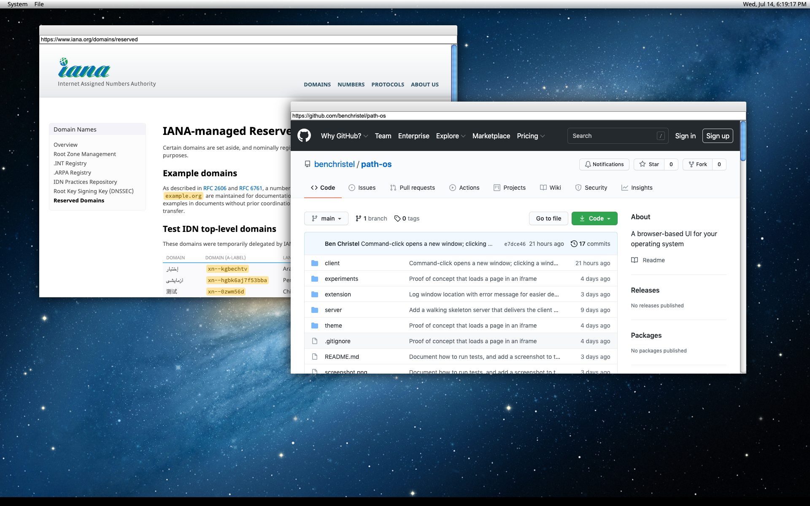

# Path OS



Path is an "operating system frontend" that runs in WebKit
browsers like Vivaldi, Chrome, and Safari. Its goal is to
provide a desktop computing experience that can:

- support real human life with a UI that incorporates
  properties of [living structure](https://www.livingneighborhoods.org/ht-0/fifteen.htm).
- be completely customized (visually and functionally)
  without modifying the host OS (e.g. macOS or Linux)
- work on many different platforms and hardware
- store files locally
- continue working pretty much forever without requiring
  major updates.

This repository houses the collection of components that
make up Path OS.

## Warning

Path OS will break your computer. Don't use it. Unless the
alternative is breaking your computer.

Seriously, there are bugs and gaping security holes and who
knows what else lurking. So just don't.

## Components

- A browser extension, which lives in `extension/`.
- A browser theme, which lives in `theme/`.
- A browser-based UI, which lives in `client/`.
- A server which interacts with the host OS on behalf of the
  client, and lives in `server/`.

## Installation (Mac OS)

- **Install [Vivaldi](https://vivaldi.com)**.
- **Hide the MacOS menu bar and dock when Vivaldi is
  fullscreened.** Open Vivaldi's `Info.plist`, which should
  be somewhere like
  `'/Applications/Vivaldi.app/Contents/Info.plist'`.
  Add the following inside the `<dict>` element inside
  `<plist>`:

  ```xml
  <key>LSUIPresentationMode</key>
  <integer>3</integer>
  ```

  This hides the menu bar, dock, and window title bar when
  Vivaldi is in focus. You must restart Vivaldi for this
  change to take effect.

  NOTE: You will have to do this again every time Vivaldi
  updates itself, it seems. :( It's also kind of glitchy:
  the menu bar will show itself if you tab away from
  Vivaldi and back again. The workaround is to restart
  Vivaldi.

- Clone this repository:
  `git clone https://github.com/benchristel/path-os`
- Go to vivaldi://extensions in Vivaldi.
- Enable developer mode.
- Load the extension in `extension/` as an unpacked
  extension.
- Build the client: `(cd client && yarn && yarn run snowpack
  build)` (assuming you already have node and yarn
  installed).
- Install Go, then run the server: `go run server/main.go`.
- Navigate to http://localhost:1234 in Vivaldi.
- For best results, fullscreen the browser window using
  `ctrl+cmd+F`. If the tabs and URL bar still show up,
  press `cmd+F10` to hide them.

## Okay, I'm staring at a picture of a galaxy. What now?

Right-click anywhere on the desktop background to open a
window. From there, you can browse as normal.

Command+clicking a link opens it in a new window. Note that
Path OS doesn't have tabs... yet.

## Development

### Auto-Reloading

Most of the time during development, you don't care about
modifying the server code, and you'd like to have changes
to the JavaScript code take effect quickly. This is
accomplished by using Snowpack to serve the client code.

```
cd client
yarn run snowpack dev
open http://localhost:8080
```

### Typechecking

Path OS uses Flow for JavaScript typechecking. To run it:

```
cd client
node_modules/.bin/flow
```

### Tests

To run the tests, navigate to http://localhost:8080/#/tests
with the snowpack dev server running. If you keep this tab
open, the tests will re-run automatically when you change a
file!

To run tests from the command line:

```
cd client
yarn test
```

Note that this is about **100x slower** than running the
tests in the browser, so it is only recommended for robots XD

## Writing Apps

An "app" in Path OS is just an HTML page. When an app starts
up, an iframe pointing to the HTML page gets created.

The app can then use PathOS APIs via `window.postMessage()`,
which allow it to do things like read and write files and
run programs on the host computer. For details, see the
`docs/` directory.
